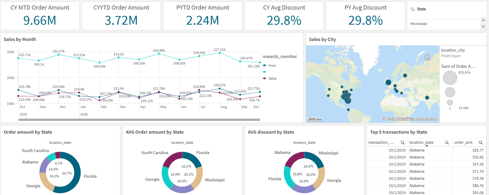

# 🛍️ Retail Sales Dashboard - Qlik Sense Cloud

This project showcases a fully interactive dashboard built in **Qlik Sense Cloud** to analyze retail sales data in some of the principal states **in the USA** like **Alabama**,**Florida**,**Georgia**, **Mississipi** and **South Carolina**. It provides key insights into sales performance, customer behavior, and product trends.




## 📊 Project Overview

The objective was to create a data visualization dashboard for a retail dataset using **Qlik Sense**. The dashboard allows users to explore:

- Total and average sales
- Sales by product line, gender, and customer type
- Sales by city
- Time-based trends
- Ratings distribution

## 🗃️ Dataset

The dataset used is [`Retail Transactions.csv`](./Retail%20Transactions.csv), which contains the following fields:

- `Invoice ID`
- `Branch`, `City`
- `Customer type`, `Gender`
- `Product line`
- `Unit price`, `Quantity`, `Tax 5%`, `Total`
- `Date`, `Time`
- `Payment`
- `cogs`, `gross income`, `gross margin %`
- `Rating`

> 📌 The file is located in the root of this repository for testing and local use.

## ⚙️ Development Process

1. **Upload and Connect Data**
   - File uploaded to Qlik Sense Cloud.
   - Data preview checked for structure and correctness.

2. **Data Formatting**
   - Dates parsed using `Date#()` and `Date()` functions.
   - Time parsed using `Timestamp#()` function.

3. **Custom Load Script**
   ```qlik
   LOAD
       [Invoice ID],
       Branch,
       City,
       [Customer type],
       Gender,
       [Product line],
       [Unit price],
       Quantity,
       [Tax 5%],
       Total,
       Date(Date#(Date, 'DD/MM/YYYY')) as Date,
       Time(Timestamp#(Time, 'hh:mm:ss')) as Time,
       Payment,
       cogs,
       [gross margin percentage],
       [gross income],
       Rating
   FROM [lib://Retail Transactions.csv]
   (txt, codepage is 28591, embedded labels, delimiter is ',', msq);


4. **Visualization Building**

   - Used KPI objects, bar charts, pie charts, line charts, and filter panes.
   - Each visualization was linked through associative fields for maximum interactivity.
  
5. **Insights**


   Based on the final dashboard view, the following **key insights** were identified:

   - **Overall Order Performance**
     - The **Current Year MTD Order Amount** reached **$9.66M**, showing strong recent performance.
     - **Year-over-year growth** is evident with **CYYTD ($3.72M)** exceeding **PYTD ($2.24M)**.

   - **Stable Discount Strategy**
     - Both **CY Avg Discount** and **PY Avg Discount** remain at **29.8%**, indicating a **consistent pricing policy**.

   - **Sales Trends by Month**
     - Sales peaked in **December and July**, likely due to seasonal effects or promotions.
     - **Rewards members** consistently spend more, emphasizing the **value of loyalty programs**.

   - **Geographic Distribution**
     - **Florida** dominates sales with **55.7%** of total order amount.
     - Other key states include **Georgia (19.2%)**, **Alabama (14%)**, **Mississippi**, and **South Carolina**.
     - The **map view** shows sales activity heavily concentrated in the **U.S.**, with **some international presence**.

   - **Order and Discount Analysis by State**
     - **Florida** leads in both total and average order value.
     - **Alabama** shows the **highest discount average (20.5%)**, likely a strategy to boost sales in a **lower-volume state**.

   - **Top Transactions**
     - Large transactions occurred in **Alabama**, with individual purchases over **$90**, suggesting **bulk orders or effective promotions**.

   These insights provide a strong foundation for further **business decision-making**, especially in areas of **geographic focus**, **discount strategies**, and **customer segmentation**.
